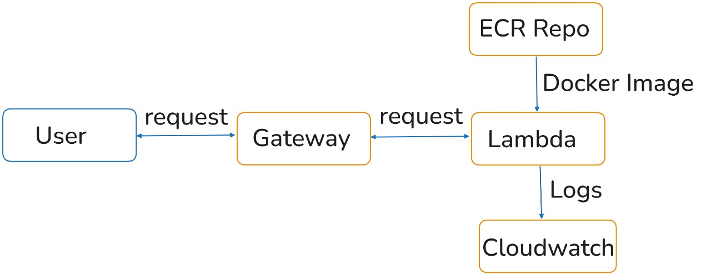
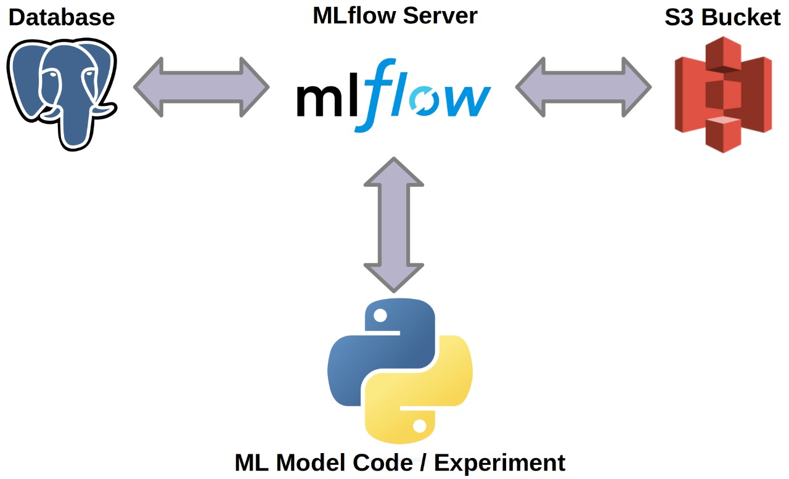
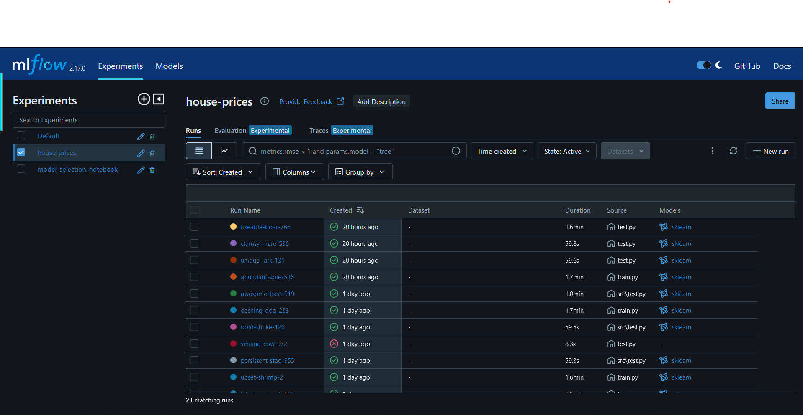

# Deploy do Modelo

Este projeto utiliza a AWS para o deploy do modelo. A arquitetura do sistema está ilustrada na figura abaixo:

## Funcionamento do Sistema

Um cliente, como um funcionário de uma corretora de imóveis, utiliza uma interface gráfica (um site, por exemplo) para enviar os parâmetros necessários. Esses parâmetros são enviados ao **gateway da API**, que os direciona para o **AWS Lambda**. O Lambda realiza a predição e:

1. Armazena o resultado no **Amazon S3**.
2. Envia os logs para o **CloudWatch**, permitindo monitoramento e análise.

## Gerenciamento de Experimentos

Para o versionamento dos experimentos e acompanhamento do progresso, foi utilizado o **MLFlow**. Ele permite:

- Armazenar os resultados de experimentos em um banco de dados SQL.
- Armazenar os artefatos dos experimentos no **Amazon S3**.
- Visualizar os experimentos por meio de sua interface gráfica, como mostrado na imagem abaixo:

Essa estrutura garante rastreabilidade, monitoramento eficiente e facilidade de uso para o cliente final. Os experimenros armazenados e modelos guardados podem ser vistos na interface grafica do mlflow como mostrado na imagem abaixo:

## Versionamento de Dados com DVC

Para gerenciar o versionamento dos dados, foi utilizado o **DVC** (Data Version Control), que oferece as seguintes funcionalidades:

- **Armazenamento em nuvem:** Os dados são armazenados diretamente no **Amazon S3**.
- **Controle de versões:** Permite rastrear e gerenciar diferentes versões dos dados utilizados para os modelos.
- **Dataset rastreado:** O dataset rastreado é o *ames.csv*, obtido a partir da API do Ames Housing.
- **Configuração de remote:** O *remote* utilizado para armazenamento é configurado no arquivo `dvc/config`, com a URL especificada como `s3://dvc-project-rodrigoap8`. 

Esse fluxo assegura organização e reprodutibilidade no ciclo de vida dos dados.

### Pipeline de Dados

Foi criado um pipeline de dados utilizando o **DVC**, que é executado periodicamente para garantir que o modelo esteja sempre atualizado. O pipeline está descrito no arquivo `dvc.yaml` e possui as seguintes etapas:

1. Baixar os dados da API do Ames Housing e executar todas as transformações necessárias.
2. Dividir os dados em treino e teste.
3. Treinar o modelo.
4. Avaliar o modelo.
5. Buildar o Docker para deploy.
6. Ativar o logging na AWS.
7. Taguear a imagem do Docker.
8. Fazer o push da imagem para o ECR.
9. Deletar o gateway antigo, para evitar conflitos.
10. Deletar o Lambda antigo, para evitar conflitos.
11. Criar a nova Lambda function.
12. Criar o novo gateway.

Essa abordagem automatiza o processo, garantindo eficiência e consistência no gerenciamento dos dados e na atualização do modelo.
